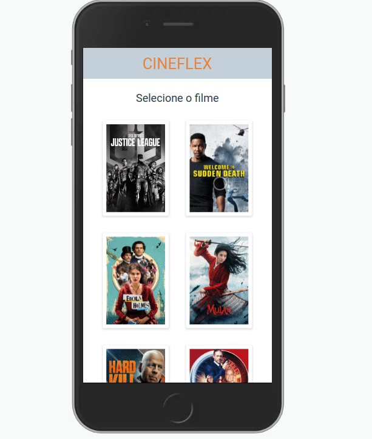

<h1 align="center">Cineflex</h1>

<h1>
<div style="display: flex; justify-content: space-around">
  </img>
</div>
</h1>

## 🔖 Sobre

Essa aplicação permite que o usuário selecione assento e sessão para seus filmes favoritos no cinema.

Clique [aqui](cineflex-swart.vercel.app) para conferir :)

## 🛠 Tecnologias utilizadas

O projeto foi desenvolvido usando as seguintes tecnologias:

- [ReactJS](https://reactjs.org)
- [Styled Components](https://styled-components.com/)
- [Axios](https://www.npmjs.com/package/axios)

## 📦 Como baixar o projeto e rodar localmente

```bash

  # Clonar repositório
  $ git clone https://github.com/samuelfcf/cineflex

  # Entrar no diretório
  $ cd cineflex

  # Instalar dependências
  $ yarn install

  # Iniciar o projeto
  $ yarn start
```

---

Desenvolvido por Samuel Felipe Castro Fernandes
